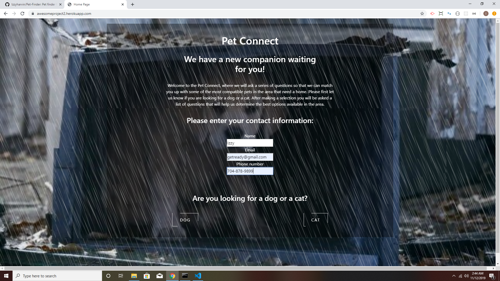
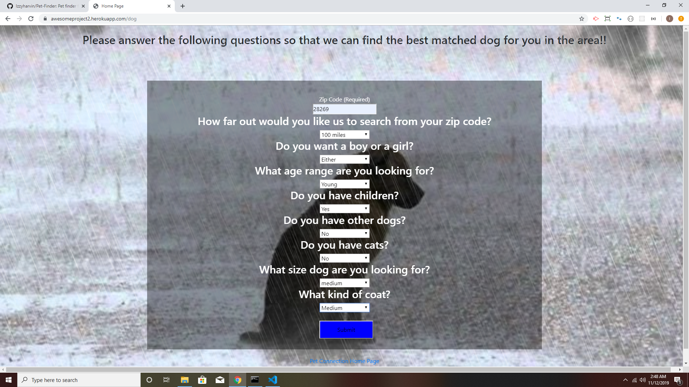
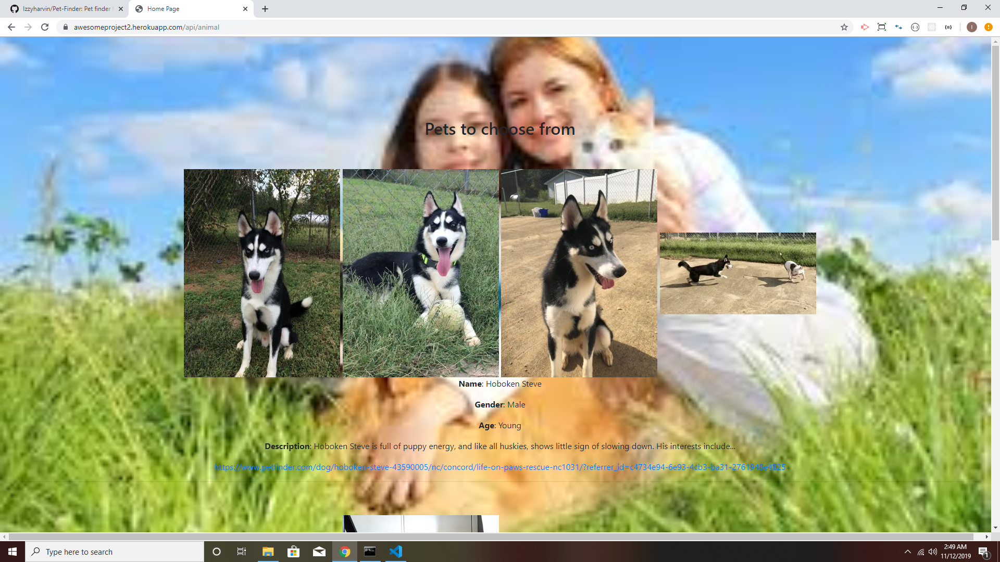
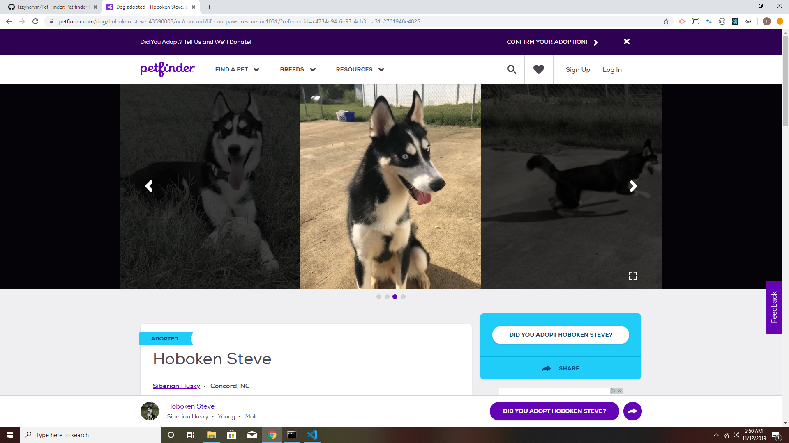

# Project-2

# Link

https://awesomeproject2.herokuapp.com/

# Languages used:

- HTML
- CSS
- Javascript

# How to use Pet Finder

- First step is go to link and page will open up.

- Next, you will enter in your name, email, and number.

- Then, you once you choose cat or dog you will be lead to some questions on what type of dog or cat you want.

- Once you answer the questions you will be send to the results page of the type of anumal you looking for.

- There will also be a link to each result that will send you to the pet finder page of that pet you choose.

